# 👋 Hi, I'm Farhan

🎓 Second-year Software Engineering student at QUT  
💻 Passionate about Full Stack Development, API Configurations and building cool tools  
🚀 On a mission to become a job-ready software engineer in 12 months

## 📊 GitHub Stats

## 🌱 Currently Learning
- Python & Data Analytics
- C# and .NET with OOP
- Microprocessor building with C
- Using Matlab to Solve Complex Engineering Maths
- Git & GitHub
- Data Structures & Algorithms
- Agile, Waterfall, V-shaped Model
